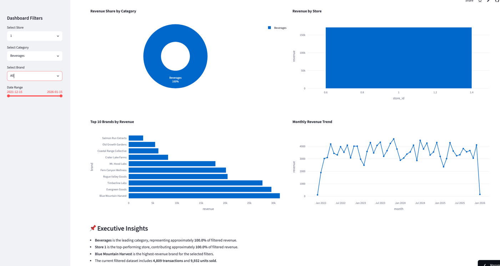

# 🌿 Cannabis Retail Intelligence Platform

An end-to-end Business Intelligence dashboard built with **Python**, **PostgreSQL**, **SQL**, **Pandas**, **Plotly**, and **Streamlit**.

## 🚀 Live Demo

### https://cannabis-retail-intelligence-platform-casxqd9rlwzshv6x9vhaoq.streamlit.app/

---

## 📸 Dashboard Preview

### Executive Dashboard


### Interactive Filters



### Executive Insights


---


---


## 📊 Project Overview

This project simulates a business intelligence platform used by a multi-store cannabis retailer.

The application demonstrates an end-to-end analytics workflow by:

- Cleaning and validating raw retail datasets with Python
- Loading data into PostgreSQL
- Writing SQL business analysis queries
- Building interactive dashboards with Streamlit
- Creating executive KPIs and visualizations
- Supporting interactive filtering by store, category, brand, and date

The dataset used is **synthetic** and intended for portfolio and educational purposes.

---

## 🌟 Features

### Executive Dashboard

- 💰 Revenue
- 💵 Estimated Profit
- 📈 Profit Margin
- 🧾 Transactions
- 📦 Units Sold
- 💳 Average Sale

### Interactive Filters

- 🏪 Store
- 🌿 Category
- 🏷 Brand
- 📅 Date Range

### Visualizations

- 🍩 Revenue Share by Category
- 📈 Monthly Revenue Trend
- 🏪 Revenue by Store
- 🏷 Top Brands by Revenue
- 📌 Executive Insights

---

## 🛠 Tech Stack

- Python
- PostgreSQL
- SQL
- Pandas
- SQLAlchemy
- Plotly
- Streamlit
- Git & GitHub

---

## 📁 Project Structure

```text
cannabis-retail-intelligence-platform/

dashboard/
    app.py
    charts.py
    data_loader.py
    insights.py
    metrics.py
    queries.py
    styles.py

src/
    etl/

sql/
    business_analysis_queries.sql

data/
    raw/
    cleaned/

README.md
requirements.txt
```

---

## 🚀 Running Locally

```bash
git clone https://github.com/YOUR_USERNAME/cannabis-retail-intelligence-platform.git

cd cannabis-retail-intelligence-platform

pip install -r requirements.txt

streamlit run dashboard/app.py
```


---

## 📚 Skills Demonstrated

- SQL Analytics
- PostgreSQL
- ETL Development
- Data Cleaning
- Data Validation
- Dashboard Development
- Business Intelligence
- Interactive Data Visualization
- Python Programming
- Git Version Control

---

## 👨‍💻 Author

**Chris Toon**

Bachelor of Science in Sociology

Post-Baccalaureate Computer Science Student

Interested in Data Analytics, Business Intelligence, Cloud Computing, and Data Engineering.
